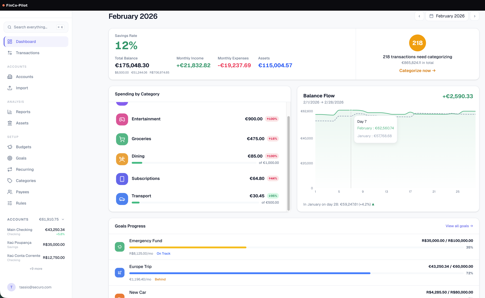

<p align="center">
  
</p>
<h1 align="center">FinCo-Pilot</h1>
<p align="center">
  <a href="https://github.com/S2zxx0zxx/FinCo-pilot/actions/workflows/ci.yml"></a>
  <a href="https://www.gnu.org/licenses/agpl-3.0"></a>
</p>

<h3 align="center">Your finances, one intelligent cockpit.</h3>

FinCo-Pilot is a privacy-first personal finance platform for managing accounts, transactions, budgets, goals, assets, invoices, shared expenses, reports, bank connections, and optional AI agents from one workspace. It is designed to keep financial data under the operator's control while providing a fast, modern web experience.

## Quick Start

**Linux & macOS** (Docker or Podman):

```bash
curl -fsSL https://raw.githubusercontent.com/S2zxx0zxx/FinCo-pilot/main/install.sh | bash
```

**Windows:** install Docker Desktop, then:

```bash
git clone https://github.com/S2zxx0zxx/FinCo-pilot.git
cd FinCo-pilot
docker compose up --build
```

Open `http://localhost:3000` and create an account.

<p align="center">
  
</p>

## Features

- Multi-account management with running balances and account reconciliation
- Transaction management with search, filters, splits, attachments, payees, and CSV export
- File imports for OFX, QIF, CAMT, CSV, and investment data
- Automatic categorization rules and reusable collections
- Recurring transactions, budgets, goals, and savings tracking
- Asset management with valuation history, transactions, grouping, and market-price support
- Net-worth, cash-flow, income/expense, and category reporting
- Shared groups, settlements, and workspace-level collaboration
- Invoice creation, attachments, PDF generation, sharing, and forecasting
- Multi-currency support with automatic FX conversion
- Optional bank synchronization through Pluggy, Enable Banking, and SimpleFIN
- Multi-user administration with workspace roles and registration controls
- TOTP two-factor authentication, passkeys/WebAuthn, and brute-force protections
- OIDC/SSO support for standard OpenID Connect providers
- Optional AI agents with multiple LLM providers, MCP tool access, and per-agent RAG knowledge bases
- Backup and restore, including optional AES-256 encrypted archives

## Bank Sync (Optional)

Configure any provider you use in `.env`, then restart the stack.

### Pluggy

```env
PLUGGY_CLIENT_ID=your-client-id
PLUGGY_CLIENT_SECRET=your-client-secret
```

### Enable Banking

```env
ENABLE_BANKING_APP_ID=your-application-id
ENABLE_BANKING_PRIVATE_KEY_FILE=/app/secrets/your-key.pem
ENABLE_BANKING_OAUTH_REDIRECT_URI=https://your-host/oauth/callback
```

### SimpleFIN

```env
SIMPLEFIN_ENABLED=true
SIMPLEFIN_API_URL=https://beta-bridge.simplefin.org
```

## Authentication and SSO

Local authentication is enabled by default. To delegate login to an OIDC provider:

```env
OIDC_ENABLED=true
OIDC_PROVIDER_NAME=Your Provider
OIDC_DISCOVERY_URL=https://id.example.com/.well-known/openid-configuration
OIDC_CLIENT_ID=fincopilot
OIDC_CLIENT_SECRET=your-client-secret
OIDC_REDIRECT_URI=https://your-finco-host/api/auth/oidc/callback
```

Set `LOCAL_AUTH_ENABLED=false` only after OIDC is fully configured and an administrator can sign in through the provider. Optional role synchronization is controlled by `OIDC_SYNC_ROLES`, `OIDC_ROLES_CLAIM`, `OIDC_ADMIN_ROLES`, and `OIDC_WORKSPACE_ROLE_MAP`.

## Passkeys

Passkeys work on `http://localhost:3000` or on an HTTPS domain. For a deployed domain, set:

```env
FRONTEND_URL=https://finance.example.com
WEBAUTHN_RP_ID=finance.example.com
```

## Exchange Rates

For automatic exchange-rate lookup:

```env
OPENEXCHANGERATES_APP_ID=your-app-id
```

Without a key, foreign-currency transactions continue to work with the application's fallback behavior.

## AI Agents (Optional)

AI features are opt-in and off by default.

```env
AGENTS_ENABLED=true
COMPOSE_PROFILES=agents
```

Then start the stack with `docker compose up -d`. Provider connections are configured from **Settings → AI Agents**. Supported integrations include OpenAI, Anthropic, Ollama, and OpenAI-compatible endpoints. The built-in MCP server can expose approved finance tools to agent workflows.

For a non-Docker installation, run the MCP service separately:

```bash
uvicorn mcp_server.main:app --host 127.0.0.1 --port 8765
```

and configure:

```env
AGENTS_BUILTIN_MCP_URL=http://127.0.0.1:8765/mcp
```

## Tech Stack

| Layer | Stack |
|---|---|
| Backend | FastAPI, SQLAlchemy, Alembic, Celery |
| Frontend | React, TypeScript, Vite, Tailwind CSS |
| Database | PostgreSQL + pgvector |
| Queue | Redis + Celery |
| AI tooling | MCP, provider adapters, RAG/embeddings |

## Development

```bash
cd backend
pip install -e ".[dev]"
pytest
```

```bash
cd frontend
npm ci
npm run typecheck
npm run lint
npm test
```

Or use the repository's `mise` tasks for installation, linting, tests, and builds.

## Security

Please report vulnerabilities privately through GitHub Security Advisories for this repository. See [SECURITY.md](SECURITY.md).

## Contributing

See [CONTRIBUTING.md](CONTRIBUTING.md) for development and contribution guidelines.

## License

This project is licensed under the [GNU Affero General Public License v3.0](LICENSE).
